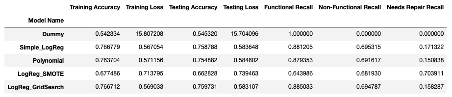
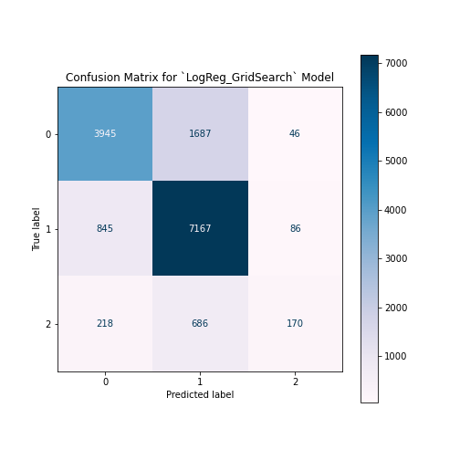
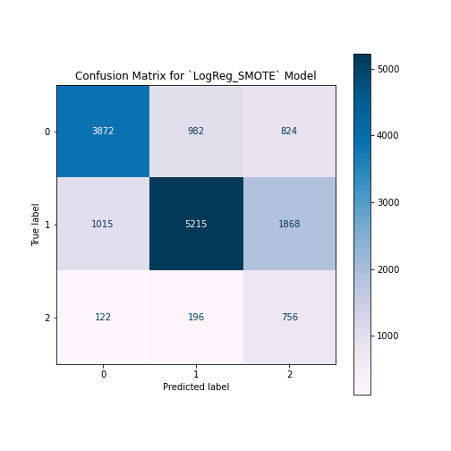

# Water Well Project

## Project Overview
The goal of this project is to build a predictive model using Logistic Regression. My intention is to show my understanding of the iterative modeling process and final model selection and evaluation.

## Business & Data Understanding
I chose [this dataset](https://www.drivendata.org/competitions/7/pump-it-up-data-mining-the-water-table/page/23/), provided by Driven Data. The set contains data on approximately 60k wells and classifies them as functional, non-functional, or functional but in need of repair. The data has 40 features we can use for prediction, and Driven Data provides a data dictionary that we use to help us clean up these features.

The following prompt is given with the data set:

"Tanzania, as a developing country, struggles with providing clean water to its population of over 57,000,000. There are many water points already established in the country, but some are in need of repair while others have failed altogether.

"Build a classifier to predict the condition of a water well, using information about the sort of pump, when it was installed, etc. Your audience could be an NGO focused on locating wells needing repair, or the Government of Tanzania looking to find patterns in non-functional wells to influence how new wells are built. Note that this is a ternary classification problem by default, but can be engineered to be binary."

I am assuming the position of a data consultant hired by WaterAid, an NGO that aims to provide clean water and toilets to those in need. WaterAid wants to know which wells to spend money visiting and fixing. I build a classification model to help them make this determination.

## Modeling

I cleaned the data before the modeling process, altering some features and dropping others.

For a baseline, I created a dummy model that predicted the majority class. This model achieved a 54% accuracy score on testing data, so that was the score to beat in later iterations.

In pre-processing, I scaled our numerical features, created missing indicators for null values, then imputed these nulls to feed the Logistic Regressor. For the categorical features, I used One Hot Encoding. I also imputed and missing indicated the nulls.

After iterating through a few variants on the first Logistic Regression, this is how the models compared:

Obviously, the first model was hard to improve on. I was able to slightly increase the testing accuracy by tuning some hyperparameters using Grid Search. However, I also liked the SMOTE model's ability to identify more of the 'Needs Repair' class. This class was by far the minority, so SMOTE helped by oversampling that class in the training data. Below are confusion matrices of both models' performance on the testing data.

I didn't want to pick just one of these models to guide my recommendations, so I went with both.

## Evaluation & Conclusion
My final recommendation is to use either the Logistic Regression with Grid Search or the Logistic Regression with SMOTE.

The Grid Search model has the highest accuracy when applied to the testing data and will lead to the most efficient use of resources. In other words, if WaterAid decides to visit wells predicted to be Non-Functional or Needing Repair, the Grid Search model will be the least likely to point them to an actually Functional well, which would result in a waste of resources.

However, the SMOTE model has the highest recall for the Needs Repair class, which is terribly low for the non-SMOTE models. By visiting wells predicted to be faulty using this model, WaterAid will fix more of the actually faulty models, at the expense of spending more money visiting wells that don't need fixing.

If budget allows, I would recommend first visiting all of the wells labeled faulty by the Grid Search model, then expanding the search using the SMOTE model.

### Final Notebook
[Notebook](https://github.com/ttrechsel/Tanzania_Well_Project/blob/main/Well_Project_Final_Notebook.ipynb)

## Presentation:
[Presentation](https://github.com/ttrechsel/Tanzania_Well_Project/blob/main/Water_Wells_Presentation.pdf)

## Contributers
Tristan Trechsel   

