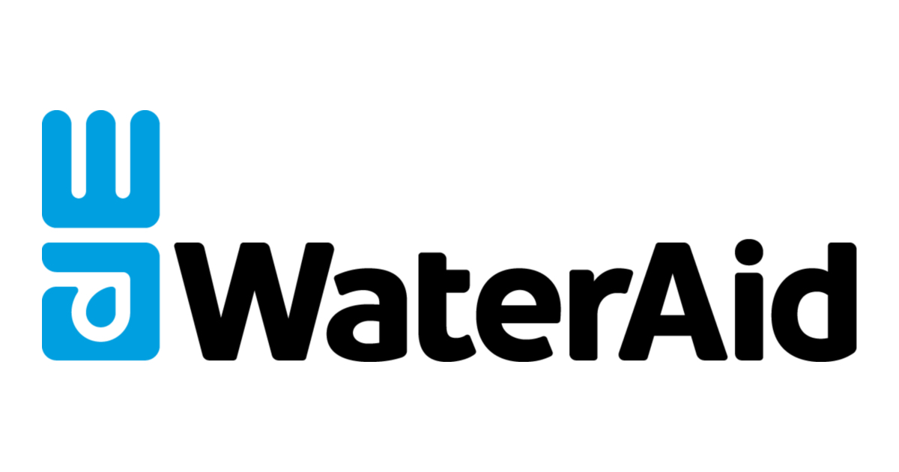
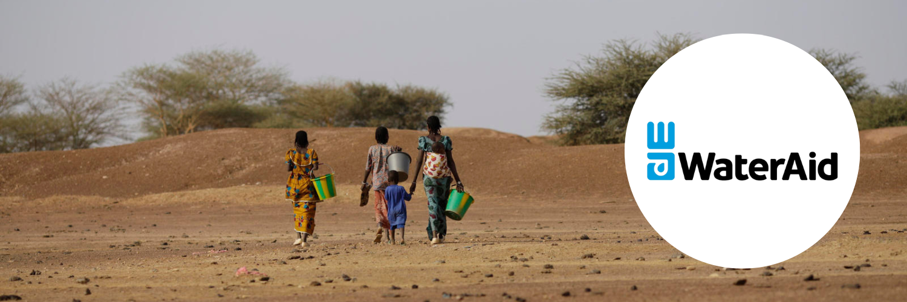

# Water Well Project

## Project Overview
The goal of this project is to build a predictive model using Logistic Regression. My intention is to show my understanding of the iterative modeling process and final model selection and evaluation.

## Business & Data Understanding
I chose [this dataset](https://www.drivendata.org/competitions/7/pump-it-up-data-mining-the-water-table/page/23/), provided by Driven Data. The set contains data on approximately 60k wells and classifies them as functional, non-functional, or functional but in need of repair. The data has 40 features we can use for prediction, and Driven Data provides a data dictionary that we use to help us clean up these features.

We are given the following prompt with this data set:

"Tanzania, as a developing country, struggles with providing clean water to its population of over 57,000,000. There are many water points already established in the country, but some are in need of repair while others have failed altogether.

"Build a classifier to predict the condition of a water well, using information about the sort of pump, when it was installed, etc. Your audience could be an NGO focused on locating wells needing repair, or the Government of Tanzania looking to find patterns in non-functional wells to influence how new wells are built. Note that this is a ternary classification problem by default, but can be engineered to be binary."

We are assuming that we have been hired by WaterAid, an NGO that aims to provide clean water and toilets to those in need.

This image shows count of movies per year. In 2019, you can notice there is a dip and that is because of lack of data points during this year. 

Here, we look at a boxplot of the gross profit for each genres. For the most part, every genre has a very similar median and many outliers. However, one thing that we can notice is that ranges for each genres vary greatly. For example, genres like Adventure, Sci-fi, and Animation have a large range, while crime and horror have a small range. This means that the genres with a smaller range have the highest chances of predicting the profit while genres like Adventure can hit it big in the theaters or not. 

We calculated the average ROI by getting the ratio of the sum of budget and sum of the gross revenue for each actor. Then we filtered for actors with at least 5 movies in the dataset. The top three actors are Tobin Bell (known for Saw/Horror films), Ray Romano (known for Ice Age/Comedy), and Viggo Mortensen (Lord of the Rings/Action/Adventure). 

We calculated the average ROI by getting the ratio of the sum of budget and sum of the gross revenue for each director. Then we filtered for directors with at least 5 movies in the dataset. The top three directors are James Wan (Insidious/Horror), Jake Kasdan (Comedy), and Carlos Saldanha (Ice Age/Animation). 

## Modeling
[Tableau](https://public.tableau.com/app/profile/gavin.martin/viz/MovieGenres_16946599359490/MovieData)

## Evaluation & Conclusion
Our final recommendation is to use either the Logistic Regression with Grid Search or the Logistic Regression with SMOTE.

The Grid Search model has the highest accuracy when applied to the testing data and will lead to the most efficient use of resources. In other words, if WaterAid decides to visit wells predicted to be Non-Functional or Needing Repair, the Grid Search model will be the least likely to point them to an actually Functional well, which would result in a waste of resources.

However, the SMOTE model has the highest recall for the Needs Repair class, which is terribly low for the non-SMOTE models. By visiting wells predicted to be faulty using this model, WaterAid will fix more of the actually faulty models, at the expense of spending more money visiting wells that don't need fixing.

If budget allows, we would recommend first visiting all of the wells labeled faulty by the Grid Search model, then expanding the search using the SMOTE model.

### Final Notebook
[Notebook](https://github.com/ttrechsel/Tanzania_Well_Project/blob/main/Well_Project_Final_Notebook.ipynb)

## Presentation:
[Google Slides](https://docs.google.com/presentation/d/1bva88xJqU2SuDrMhn5D2jdZ_Wj9cw52Ofb1wlqBg-uQ/edit?usp=sharing)

## Contributers
Tristan Trechsel   

